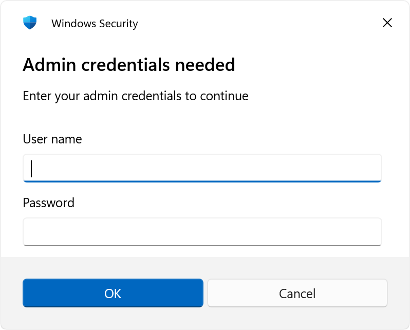
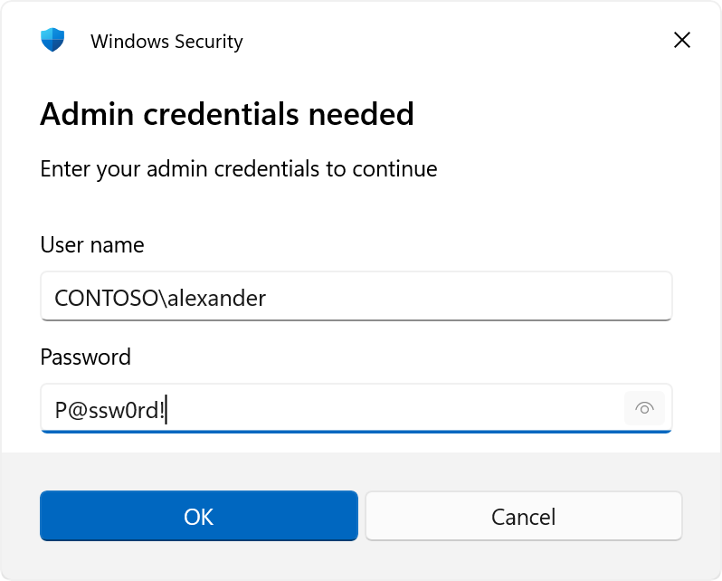
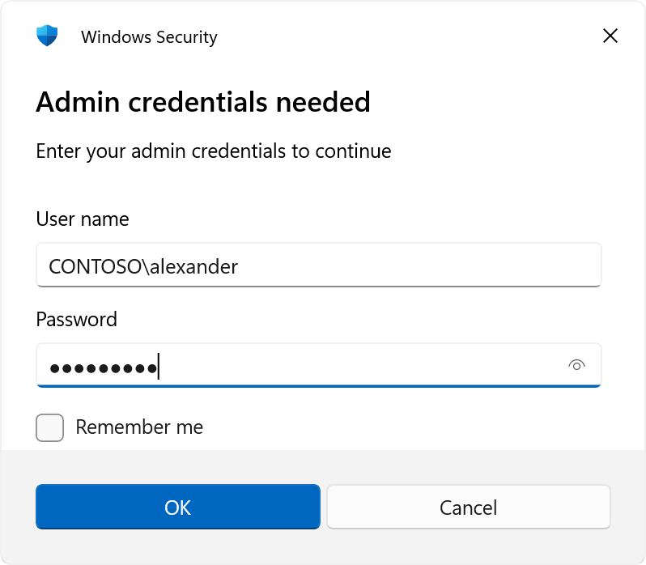
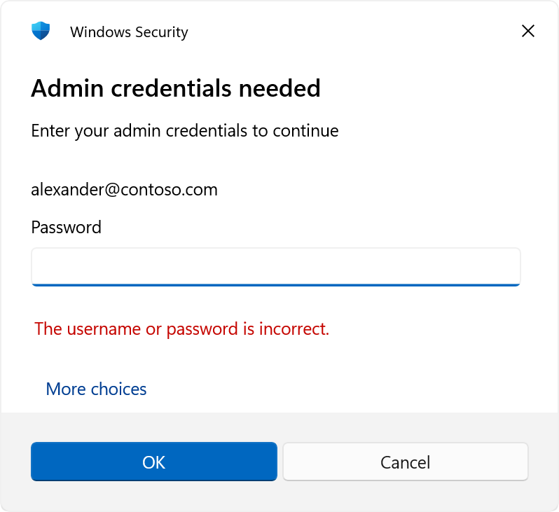
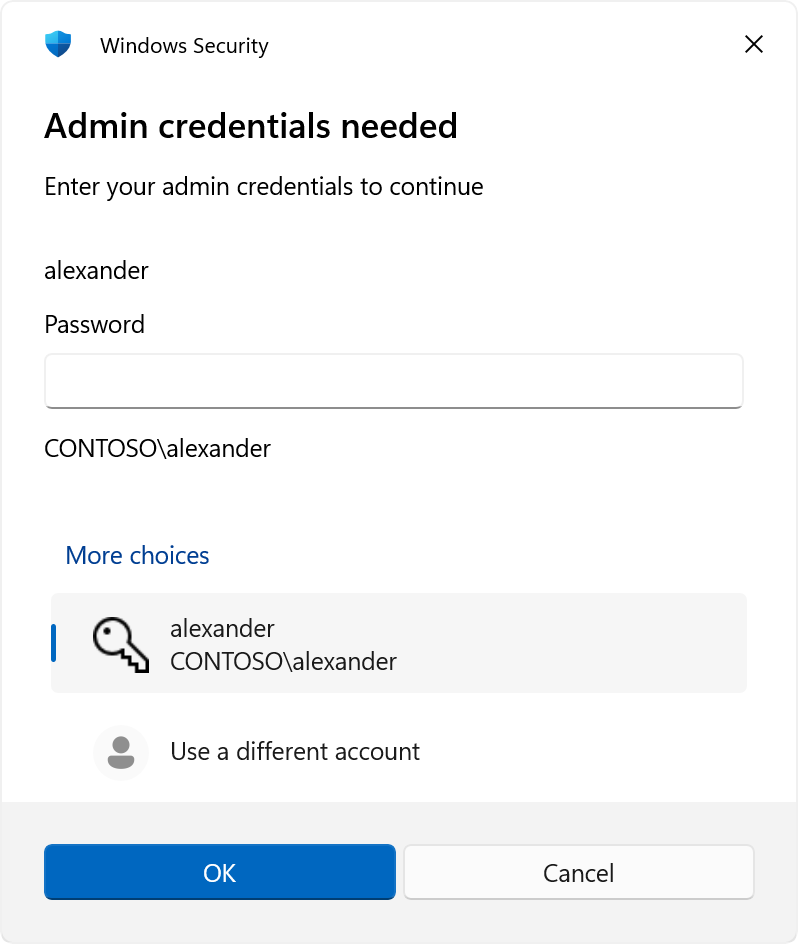

# CredUICredential

**The modern Windows credential dialog for PowerShell 7 — a drop-in replacement for `Get-Credential`.**

[](https://github.com/AlexCMarty/CredUICredential/actions/workflows/ci.yml)
[](https://www.powershellgallery.com/packages/CredUICredential)
[](https://www.powershellgallery.com/packages/CredUICredential)
[](LICENSE.txt)

`Get-Credential` on PowerShell 7 prompts in the terminal, where the password is a row of asterisks
nobody can check. `Get-CredUICredential` raises the real Windows credential dialog instead — the one
Windows itself uses for RDP logins — and hands back the same `PSCredential`.

**Requires Windows, and PowerShell 7.6 or later to install** (x64 or x86).

## Install

```powershell
Install-PSResource CredUICredential
```

## Quick start

```powershell
$creds = Get-CredUICredential -Title 'Admin credentials needed' -Message 'Enter your admin credentials to continue'
```



In an existing script, change the cmdlet name and nothing else:

```diff
- $creds = Get-Credential
+ $creds = Get-CredUICredential
```

## Why not `Get-Credential`?

In PowerShell 7 the built-in cmdlet prompts in the terminal:

```
PowerShell credential request
Enter your credentials.
User: firstname-lastname
Password for user firstname-lastname: **********
```

It gets the job done, but the user cannot check what they typed, has to be watching the terminal to
notice the prompt at all, and gets no visual signal that it is Windows asking for a password rather
than a script asking for any old string.

`Get-CredUICredential` calls `CredUIPromptForWindowsCredentials` in **credui.dll**, so the prompt is
drawn by Windows. That buys the platform's behaviour rather than reimplementing it:

|  | `Get-Credential` | `Get-CredUICredential` |
| --- | --- | --- |
| Prompt | Terminal text | Native Windows dialog |
| Reveal what was typed | No, asterisks only | Yes — the password box's peek glyph |
| Script running in the background | Prompt waits unseen in the terminal | A real window, which comes to the front |
| Theme | Whatever the terminal is | Follows Windows: light, dark, high contrast |
| Window title | n/a | `-Title`, which password managers can match on |
| Save check box | No | `-ShowSaveCheckbox` |
| Check the password before returning | No | `-RetryNormalUser` / `-RetryAdminUser` |
| Returns | `PSCredential` | `PSCredential` |
| Runs on | Windows, macOS, Linux | Windows only |

The peek glyph is the one users notice. It is hold-to-show, and it is most of the argument for the
P/Invoke:



## What it adds

Everything `Get-Credential` takes, `Get-CredUICredential` takes too, under the same names and the
same parameter sets. On top of that:

| Parameter | What it does |
| --- | --- |
| `-Message` | The text in the body of the dialog. Same as `Get-Credential`. |
| `-Title` | The dialog's heading. Useful with password managers such as KeePass, which match a window's title to decide what to auto-type. |
| `-UserName` | Pre-fills the user name. The user can still replace it, via **More choices → Use a different account**. |
| `-ShowSaveCheckbox` | Adds Windows' save check box. Changes the return type — see below. |
| `-RetryNormalUser` | Keeps prompting until the password actually logs on. |
| `-RetryAdminUser` | The same, but the account must also be a local administrator. |
| `-MaxAttempts` | How many attempts the retry switches get. Default 3, range 1–10. |

Two of those need more than a table row.

### `-ShowSaveCheckbox` changes the return type

There are now two things to report back, so the cmdlet returns an object with `Credential` and
`Checkbox` properties instead of a bare `PSCredential`. This is the one place the drop-in claim does
not hold.

```powershell
$result = Get-CredUICredential -ShowSaveCheckbox
$result.Credential   # a PSCredential, same as always
$result.Checkbox     # $true or $false
```



Windows does not allow that label to be changed — it says "Remember me" — and ticking it saves
nothing by itself. Acting on `$result.Checkbox` is your script's job.

### The retry switches check the password

`-RetryNormalUser` calls `LogonUser` against this computer and re-prompts until the credential works,
the user cancels, or `-MaxAttempts` runs out. A wrong password comes back as Windows' own error
banner rather than as a PowerShell error:



Cancelling writes nothing to the pipeline; running out of attempts writes an error. Only a genuine
logon failure is retried — a locked out, disabled or expired account stops immediately, rather than
burning the account further.

`-RetryAdminUser` also requires the local Administrators SID in the token, which is how it sees
through the filtered token UAC hands out. The two switches cannot be combined.

## Security notes

The dialog is seeded with the Kerberos authentication package, which keeps PIN and smart card off
**More choices**. Neither is a reusable password, and a script asking for a `PSCredential` has
nothing it can do with one:



As a backstop, anything that comes back tagged as something other than a user-name-and-password
logon is rejected rather than returned. Under the retry switches that rejection costs an attempt and
raises the dialog again.

The authentication buffer Windows hands back holds the password in the clear. It is zeroed and
released on every path out, the failures included.

## Documentation

`Get-Help Get-CredUICredential -Full` works once the module is installed. The same content lives in
[CredUICredential.md](CredUICredential.md), which is what that help is generated from. For anything
the two cmdlets share, `Get-Credential`'s documentation applies.

## Building from source

```powershell
dotnet build
dotnet test tests/CredUICredential.Tests/CredUICredential.Tests.csproj -c Release
```

The tests run against the Release build and need the generated help file, so on a clean tree run
`pwsh ./Update-Help.ps1` first. Note that a PowerShell session with the module imported holds a lock
on the Release DLL, and a build will fail to overwrite it until that session exits.

`tools/CredUiSmoke/` drives the real dialog through UI Automation with nobody at the keyboard. It is
how the screenshots above were taken, and how claims about the credential provider UI get checked:
the xunit suite replaces the native prompt, so nothing in it ever sees that surface. It sits outside
the solution on purpose, so neither `dotnet build` nor CI builds it.

## Acknowledgement

This module is a fork of [Get-WinCredential](https://github.com/zbalkan/Get-WinCredential) by
[Zafer Balkan](https://github.com/zbalkan), archived by its original author. All credit for the original design and
implementation goes to them; this fork exists to keep the module published and maintained on the PowerShell Gallery.

The idea of the original POC stemmed from [a StackOverflow question](https://stackoverflow.com/q/70570097/5910839) by [BubblesTheTurtle](https://stackoverflow.com/users/6211486/bubblestheturtle).

The code is based on the [Credential Management API examples by Alan Dean](https://www.developerfusion.com/code/4693/using-the-credential-management-api/).

## License

[MIT](LICENSE.txt).
